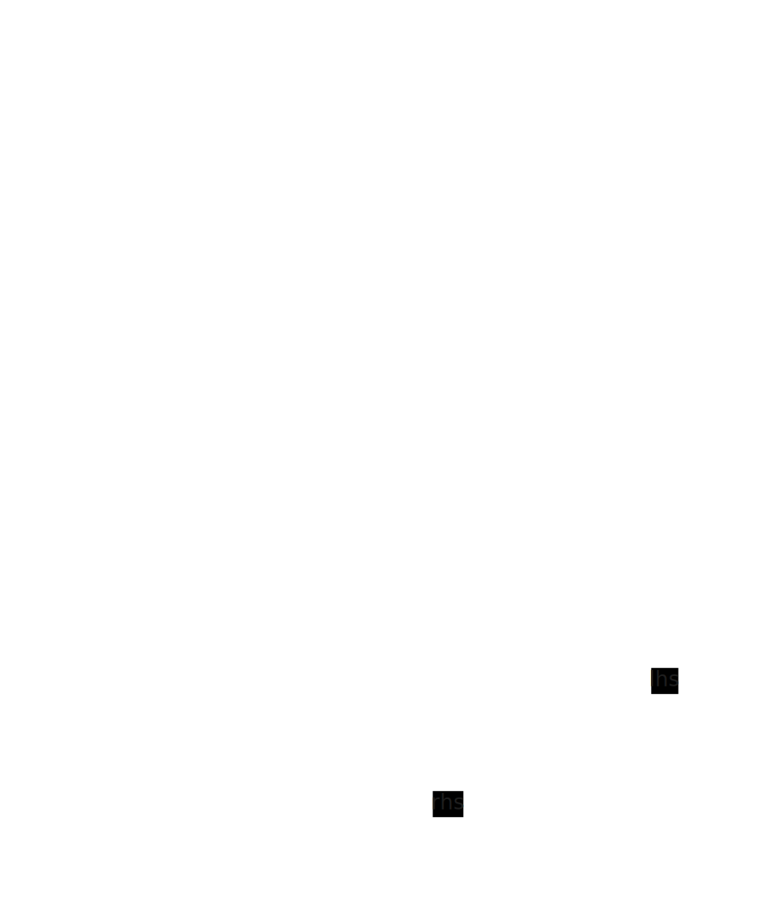

# 支持语句表达式

表达式即 expr， 语句即 stmt，语句表达式是可以作为表达式的语句，即 `({ ... })`



## 词法分析

语句表达式的类型是其中最后一个表达式语句lhs的类型
- 无论return还是 "x;" 作为结尾，a0寄存器都将作为返回值存放的位置，此处类型即指a0寄存器中所保存数据的类型

```c
void add_type(Node *node) {
  ...
  case ND_STMT_EXPR:
    // ND_STMT_EXPR类型为其中最后一个ND_EXPR_STMT lhs的类型
    if (node->body) {
      Node *stmt = node->body;
      while (stmt->next)
        stmt = stmt->next;
      if (stmt->kind == ND_EXPR_STMT) {
        node->type = stmt->lhs->type;
        return;
      }
    }

    error_token(node->token,
                "statement expression returning void is not supported");
    return;
    ...
}
```

## 语法分析

primary语法分析中，增加对于语句表达式的解析

```
// primary = "(" "{" stmt+ "}" ")"
//           | "(" expr ")"
//           | "sizeof" unary
//           | ident
//           | fncall
//           | str
//           | num
```
primary中同时增加对于 `"(" "{" stmt+ "}" ")"` 的处理

```c
  if (equal(token, "(") && equal(token->next, "{")) {
    Node *node = new_node(ND_STMT_EXPR, token);
    node->body = compound_stmt(&token, token->next->next)->body;
    *rest = skip(token, ")");
    return node;
  }

```

## 语义分析

语义分析的表达式处理中，增加对于语句表达式的处理，即在 gen_expr 中，也可以有 gen_stmt

```c
void gen_expr(Node *node) {
  ...
  case ND_STMT_EXPR:
    for (Node *n = node->body; n; n = n->next)
      gen_stmt(n);
    return;
  ...
}
```