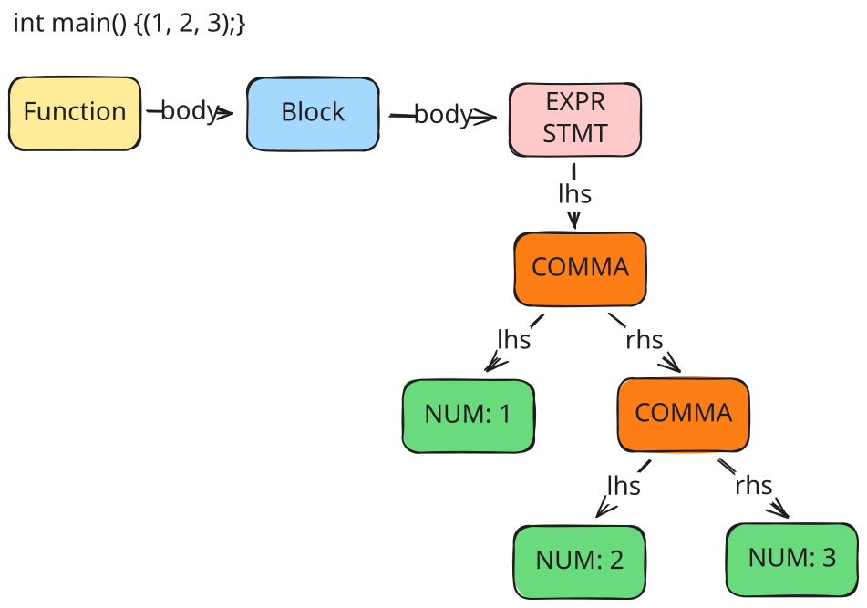

# 用C重写测试

当前编译器已具备初步功能，能够与gcc编译工具链协作进行简单的代码编译，因此可以使用C来重新编写测试代码。

测试程序都会引用 `test.h` 头文件，并首先由gcc编译器进行预处理，再交给rvcc编译为汇编代码。而最后的汇编代码会与common一起由gcc编译器编译并静态链接为一个二进制文件，交给qemu-riscv模拟器执行

```c
// test.h
// assert函数在common中，并随后静态链接到最终代码中
#define ASSERT(x, y) assert(x, y, #y)

// arith.c
#include "test.h"

int main() {
  // [1] 返回指定数值
  ASSERT(0, 0);
  ASSERT(42, 42);
  // [2] 支持 + - 运算符
  ASSERT(21, 5 + 20 - 4);
  ...
}

```

assert函数的具体作用如下，其由gcc编译器编译并静态链接到最终的二进制文件中。

```c
// common
#include <stdio.h>
#include <stdlib.h>

void assert(int expected, int actual, char *code) {
  if (expected == actual) {
    printf("%s => %d\n", code, actual);
  } else {
    printf("%s => %d expected but got %d\n", code, expected, actual);
    exit(1);
  }
}
```


> `-E`选项要求gcc编译器只进行预处理，`-P`选项要求编译器忽略`#line`指示符，`-C`要求gcc编译器保留注释，而 `-xc` 则要求gcc将输入文件视为c文件并进行编译

测试脚本修改
- `test/%.out` 规则：用于编译可由qemu-riscv执行的完整二进制文件
- `test`：遍历所有编译好的`.out`文件，并调用qemu解释执行

```makefile
# 测试标签，运行测试
test/%.out: rvcc test/%.c
	$(RISCV)/bin/riscv64-unknown-linux-gnu-gcc -o- -E -P -C test/$*.c | ./rvcc -o test/$*.s -
	$(RISCV)/bin/riscv64-unknown-linux-gnu-gcc -static -o $@ test/$*.s -xc test/common

test: $(TESTS)
	for i in $^; do echo $$i; $(RISCV)/bin/qemu-riscv64 -L $(RISCV)/sysroot ./$$i || exit 1; echo; done
	test/driver.sh
```

# 支持`,`运算符

`()` 中可以包含多个 expr， 这些 expr 使用 `,` 运算符隔开，其中最后一个 `expr` 将作为 `()` 中包含的所有 expr 在 `,` 运算下的结果。



## 语法分析

增加新的节点类型，用来连接 `()` 中的不同 expr, Comma的类型由其右子节点的类型决定（对运算而言，是最后一个expr的类型）

```c
case ND_COMMA:
  node->type = node->rhs->type;
```

同时，EXPR_STMT 现在可以由多个 EXPR 使用 COMMA 连接组成，因此递归下降中新增规则如下

```c
// expr = assign ("," expr)?
```

```c
PARSER_DEFINE(expr) {
  Node *node = assign(&token, token);

  if (equal(token, ","))
    return new_node_bin(ND_COMMA, node, expr(rest, token->next), token);

  *rest = token;
  return node;
}
```

## 语义分析

expr表达式处理过程中，对ND_COMMA从左向右处理

```c
  case ND_COMMA:
    // 处理左臂表达式
    gen_expr(node->lhs);
    // 递归处理右臂，并将其结果作为地址进行返回
    gen_addr(node->rhs);
```

变量地址计算中，将ND_COMMA运算的最后一个变量地址存放到寄存器中
```c
  case ND_COMMA:
    // 处理左臂表达式
    gen_expr(node->lhs);
    // 递归处理右臂，并将其结果作为地址进行返回
    gen_addr(node->rhs);
```