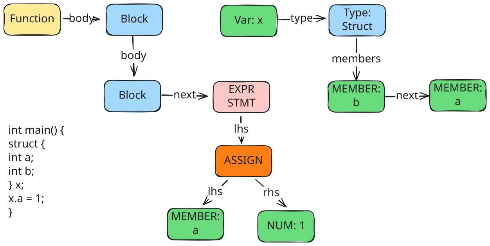

# 支持struct

结构体是一种复杂的`数据类型`，允许在一片内存空间组合**不同类型的数据**，这些不同的数据类型称为结构体成员。同时，结构体提供了一个**命名空间**，使得其成员变量能够通过结构体实例来进行访问。
- 结构体类比于数组，同样是一种存储数据集合的结构，数组存储的为类型相同的数据集合，并使用下标进行索引，而结构体则提供了更灵活的数据管理方式，存储类型不同的数据，并使用命名进行索引




编译器要支持结构体类型，需要各个阶段增加逻辑，主要如下：
- 在词法分析中增加`struct`关键词的识别
- 抽象语法树中增加对于结构体类型的解析，同时还需要支持使用`.`访问成员变量的语法
- 代码生成中增加对结构体成员地址偏移的计算

使用如下结构体来描述一个struct的成员，同一个struct的所有成员通过链表连接到一起
- 每个结构体成员有自己的`type`和`offset`，用来计算在内存中的存储位置和读取方式
- 每个结构体成员有自己的`name`，用来在一个struct中索引成员变量

```c
// AST中用于描述结构体成员的数据结构
struct Member {
  Member *next; // 下一成员
  Type *type;   // 类型
  Token *name;  // 名称
  int offset;   // 偏移量
};
```

## 词法分析

将`struct`标记为关键字

## 语法分析

> 当前处理过程中，结构体是一个仅在编译时存在的数据类型，而在编译后的代码中不存在相应的内容

词法分析中，需要解决两个问题
- 解析构体类型的声明，获取结构体的成员类型、名称等信息，并计算每个成员的偏移量
- 解析结构体引用，即`.`操作符，针对成员变量的访问生成对应的AST节点

增加`struct`的类型声明的支持，用以生成struc的类型信息

```c
// declspec = "char" | "int" | struct_decl
```

增加`struct`成员变量声明的支持

```c
// struct_members = (declspec declarator (","  declarator)* ";")*
// structDecl = "{" structMembers
```
成员变量的声明方式与局部变量声明类似，首先需要解析成员的类型，并获取其名称，将这些信息保存到member数据中，并通过链表串联起来，最后将链表头保存到struct类型的member成员中

```c
static void struct_members(Token **rest, Token *token, Type *type) {
  Member head = {};
  Member *cur = &head;

  while (!equal(token, "}")) {
    Type *base_type = declspec(&token, token);
    int first = true;

    // 形如 `int a, *b, c;`
    while (!consume(&token, token, ";")) {
      if (!first)
        token = skip(token, ",");
      first = false;

      Member *member = calloc(1, sizeof(Member));
      member->type = declarator(&token, token, base_type);
      member->token = member->type->token;
      cur = cur->next = member;
    }
  }

  *rest = token->next;
  // 此type为struct
  type->members = head.next;
}
```

在解析完成员类型之后，还需要进一步计算每个成员的偏移量，将这些数据填充到member中，并最终得到struct类型的大小

```c
static Type *struct_decl(Token **rest, Token *token) {
  token = skip(token, "{");

  // 构造一个结构体
  Type *type = calloc(1, sizeof(Type));
  type->kind = TY_STRUCT;
  struct_members(rest, token, type);

  // 计算成员的偏移量
  int offset = 0;
  for (Member *member = type->members; member; member = member->next) {
    member->offset = offset;
    offset += member->type->size;
  }
  type->size = offset;
  return type;
}
```

增加`struct`成员变量访问的支持

```c
// postfix = primary ("[" expr "]" | "." ident)*
```

使用`.`时，即需要对结构体成员进行访问，这一操作会对应AST中的一个Member节点
- Member节点的lhs指向结构体x类型的变量
- Member节点的member字段指向Member成员
- 与多维数组类似，允许嵌套的访问，并在lhs上链接起来

```c
static Member *get_struct_member(Type *type, Token *token) {

  for (Member *member = type->members; member; member = member->next) {
    if (member->token->len == token->len &&
        !strncmp(member->token->loc, token->loc, token->len))
      return member;
  }

  error_token(token, "struct has no such member");
  return NULL;
}

static Node *struct_ref(Node *lhs, Token *token) {
  add_type(lhs);
  if (lhs->type->kind != TY_STRUCT)
    error_token(lhs->token, "not a struct");

  // 成员为单臂节点，并指向结构体
  Node *node = new_node_unary(ND_MEMBER, lhs, token);
  node->member = get_struct_member(lhs->type, token);
  return node;
}

PARSER_DEFINE(postfix) {
  Node *node = primary(&token, token);

  while (true) {
    ... 

    // x.y.z
    if (equal(token, ".")) {
      node = struct_ref(node, token->next);
      token = token->next->next;
      continue;
    }

    ...
  }
}
```

## 语义分析

语义分析的核心在于将成员变量的访问，转化为结构体变量+成员偏移的内存访问计算，因此在地址计算中增加如下规则

```c
  case ND_MEMBER:
    gen_addr(node->lhs);
    println("  # 计算成员变量的地址偏移量");
    println("  li t0, %d", node->member->offset);
    println("  add a0, a0, t0");
    return;
```

而在访问中，Member与Var的处理一致，均在计算得到地址后，将数据从内存地址加载到a0寄存器

```c
  case ND_VAR:
  case ND_MEMBER:
    gen_addr(node);
    load(node->type);
    return;
```
