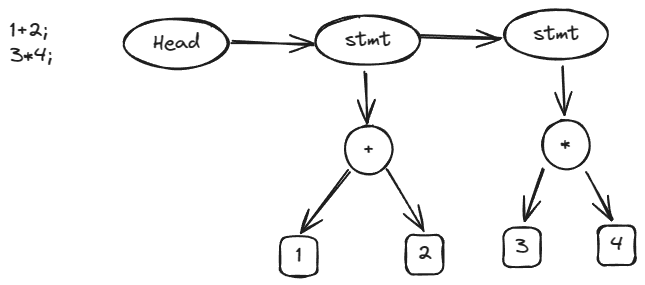
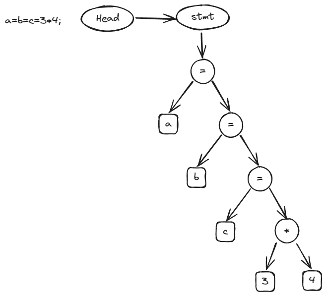

## 支持多段

支持 `;` 分割多段表达式，每段都编译，执行时只有最后一段结果保留



**词法分析**

`;` 包含在标点符号中，不必修改

**语法分析**

在原有的语法树的基础上，扩充对多个语段的支持， 在 Node 结构体中增加 `next` 字段, 指向不同的语段

```c
struct Node {
  NodeKind kind;
  Node *next;
  Node *lhs;
  Node *rhs;
  int val;
};
```

更新形式语言

```
// program = stmt*
// stmt = expr_stmt
// expr_stmt = expr ";"
// expr = equality
// equality = relational ("==" relational | "!=" relational)*
// relational = add ("<" add | "<=" add | ">" add | ">=" add)*
// add = mul ("+" mul | "-" mul)*
// mul = unary ("*" unary | "/" unary)*
// unary = ("+" | "-") unary | primary
// primary = "(" expr ")" | num
```

`expr_stmt`中将语法树挂载 `rhs`上

```
static Node *expr_stmt(Token **rest, Token *token) {
  Node *node = new_node_unary(ND_EXPR_STMT, expr(&token, token));
  *rest = skip(token, ";");
  return node;
}
```

stmt 节点的 next 指向下一个 stmt

```c
Node *parse(Token *token) {
  Node head = {};
  Node *cur = &head;
  while (token->kind != TK_EOF) {
    cur->next = stmt(&token, token);
    cur = cur->next;
  };
  return head.next;
}
```

**语义分析**

增加对于 ND_EXPR_STMT 类型的 Node 的解析

```c
static void gen_stmt(Node *node) {
  if (node->kind == ND_EXPR_STMT) {
    gen_expr(node->rhs);
    return;
  }

  error("invalid statement");
}

void codegen(Node *node) {
  printf("  .globl main\n");
  printf("main:\n");

  for (Node *n = node; n; n = n->next) {
    gen_stmt(n);
    assert(STACK_DEPTH == 0);
  }

  printf("  ret\n");
}

```

## 支持单字母本地变量

本地变量是一种新的token，需要增加token种类
本地变量代表的是内存地址，支持单字母本地变量需要为变量计算内存地址
变量是一种新的节点，赋值语句是一种新的语法，需要增加赋值语句节点
赋值是一种新的语法，需要新的语义分析，同时还需要支持 `a=b=c=1`的递归赋值




**词法分析**

单字母对应[a,z], 增加相应的字符判断即可，同时增加 `ident` token种类

**语法分析**

更新形式语言

```
// program = stmt*
// stmt = expr_stmt
// expr_stmt = expr ";"
// expr = assign
// assign = equality ("=" assign)?
// equality = relational ("==" relational | "!=" relational)*
// relational = add ("<" add | "<=" add | ">" add | ">=" add)*
// add = mul ("+" mul | "-" mul)*
// mul = unary ("*" unary | "/" unary)*
// unary = ("+" | "-") unary | primary
// primary = "(" expr ")" | ident｜ num
```

递归 assign 实现

```c
// assign = equality ("=" assign)?
static Node *assign(Token **rest, Token *token) {
  Node *node = equality(&token, token);

  // a=b=1;
  if (equal(token, "="))
    node = new_node_bin(ND_ASSIGN, node, assign(&token, token->next));
  *rest = token;
  return node;
}

primary 中增加对于 ident 解析
```

**语义分析**


栈布局
```
//-------------------------------// sp
//              fp                  fp = sp-8
//-------------------------------// fp
//              'a'                 fp-8
//              'b'                 fp-16
//              ...
//              'z'                 fp-208
//-------------------------------// sp=sp-8-208
//           表达式计算
//-------------------------------//
```
地址计算
```c
// 计算给定节点的内存地址
static void gen_addr(Node *node) {
  if (node->kind == ND_VAR) {
    int offset = (node->name - 'a') * 8;
    printf("  addi a0, fp, %d\n", -offset);
    return;
  }

  error("not an lvalue");
}
```

assign 语义

```c
  case ND_ASSIGN:
    // 左值
    gen_addr(node->lhs);
    push();
    // 右值
    gen_expr(node->rhs);
    // 栈上保存的是左值内存地址, 弹出到 a1 寄存器
    pop("a1");
    printf("  sd a0, 0(a1)\n");
    return;
```
同时也增加了 sp 与 fp 的保存与恢复

```c
printf("  addi sp, sp, -8\n");
printf("  sd fp, 0(sp)\n");
// 将当前的 sp 设置为 fp
printf("  mv fp, sp\n");

// 恢复 sp
printf("  mv sp, fp\n");
// 恢复上一个 fp
printf("  ld fp, 0(sp)\n");
printf("  addi sp, sp, 8\n");
```