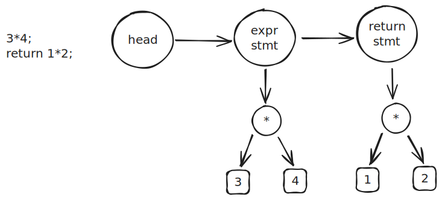
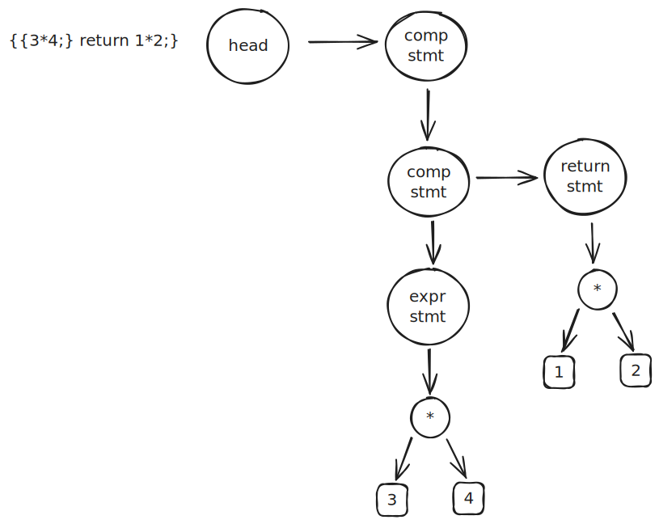

# 支持 return




## 词法分析

return 作为一种特殊的 ident，在完成token的初步生成之后，再对符合 keyword 的token 进行标记

```c
// 将符合关键字的 token 类型修改为 TK_KEYWORD
static void convert_keywords(Token *token) {
  for (Token *t = token; t; t = t->next) {
    if (equal(t, "return")) {
      t->kind = TK_KEYWORD;
    }
  }
}
```

## 语法分析

形式语言中修改 stmt 的表达， 注意  ` "return" expr ";"` 与 `expr_stmt` 位于统一级别

```
// stmt =  "return" expr ";"| expr_stmt
```

增加一个 return node，return stmt 

```
static Node *stmt(Token **rest, Token *token) {

  if (token->kind == TK_KEYWORD && equal(token, "return")) {
    Node *node = new_node_unary(ND_RETURN, expr(&token, token->next));
    *rest = skip(token, ";");
    return node;
  }

  return expr_stmt(rest, token);
}
```

## 语义分析

在程序末尾增一个 return 标签，而 return node 则会跳转到此 label

```c
static void gen_stmt(Node *node) {
  if (node->kind == ND_EXPR_STMT) {
    gen_expr(node->rhs);
    return;
  }

  switch (node->kind) {
  case ND_EXPR_STMT:
    gen_expr(node->rhs);
    return;
  case ND_RETURN:
    gen_expr(node->rhs);
    printf("  j .L.return\n");
    return;
  default:
    break;
  }

  error("invalid statement");
}
```

# 支持代码块



## 词法分析

`{ | }` 本身就是符号，无需进行修改

## 语法分析

增加 `ND_Block` 节点，修改推导式，同时约定每个 Funcion 必须从 ND_Block 开始

```
// program = "{" compoundStmt
// compoundStmt = stmt* "}"
// stmt = "return" expr ";"| "{" compoundStmt | expr_stmt

```

增加 ND_Block 的处理

```c
// compoundStmt = stmt* "}"
PARSER_DEFINE(compound_stmt) {
  Node head = {};
  Node *cur = &head;
  while (!equal(token, "}")) {
    cur->next = stmt(&token, token);
    cur = cur->next;
  }

  Node *node = new_node(ND_BLOCK);
  node->body = head.next;
  *rest = token->next;
  return node;
}

// stmt = "return" expr ";"| "{" compoundStmt | expr_stmt
PARSER_DEFINE(stmt) {

  if (token->kind == TK_KEYWORD && equal(token, "return")) {
    Node *node = new_node_unary(ND_RETURN, expr(&token, token->next));
    *rest = skip(token, ";");
    return node;
  }

  if (equal(token, "{")) {
    return compound_stmt(rest, token->next);
  }

  return expr_stmt(rest, token);
}
```

## 语义分析

ND_Block 也是 stmt， 同时也可以嵌套

```
static void gen_stmt(Node *node) {
  switch (node->kind) {
  case ND_EXPR_STMT:
    gen_expr(node->rhs);
    return;
  case ND_RETURN:
    gen_expr(node->rhs);
    printf("  j .L.return\n");
    return;
  case ND_BLOCK:
    for (Node *n = node->body; n; n = n->next) {
      gen_stmt(n);
    }
    return;
  default:
    break;
  }

  error("invalid statement");
}
```

# 允许空语句

## 词法分析

允许 expr 为空

```
// expr_stmt = expr? ";"
```

发现空 stmt 时，返回空 ND_BLOCK 即可
```
PARSER_DEFINE(expr_stmt) {
  if (equal(token, ";")) {
    *rest = token->next;
    return new_node(ND_BLOCK);
  }

  Node *node = new_node_unary(ND_EXPR_STMT, expr(&token, token));
  *rest = skip(token, ";");
  return node;
}
```