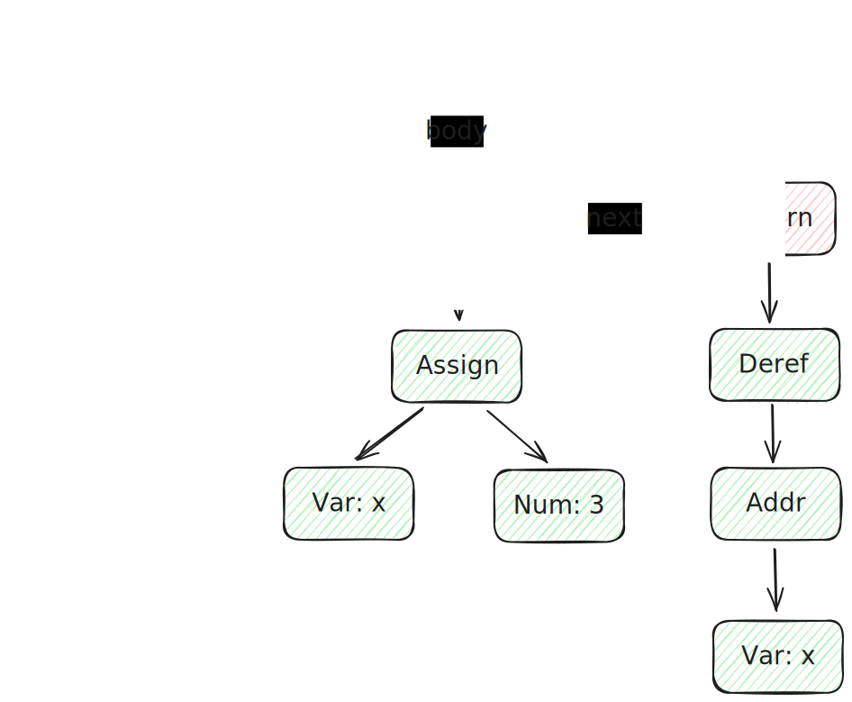
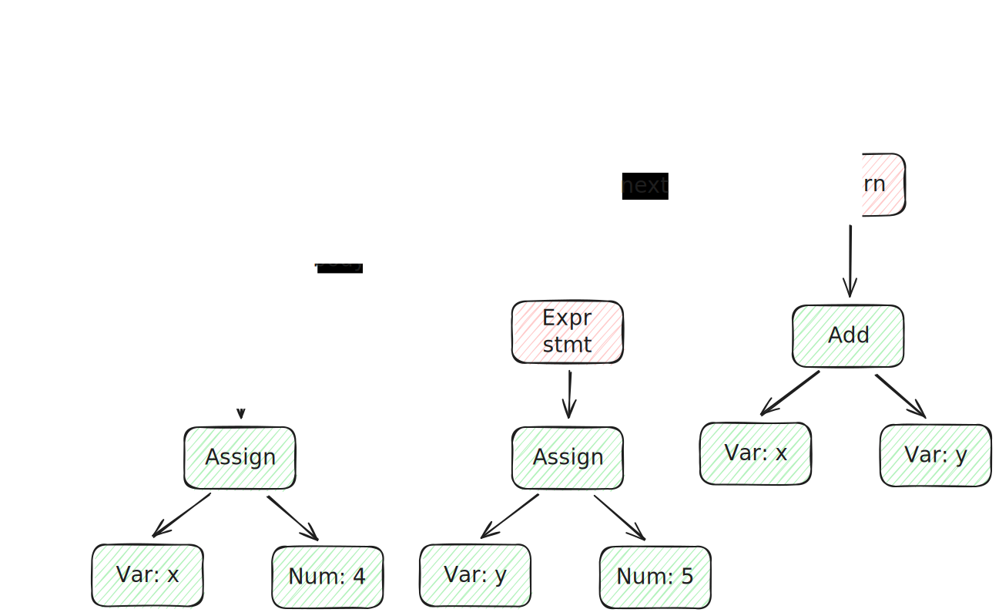

# 支持一元&*运算



## 词法分析

支持 `*` `&` 两种符号， 而考虑到 tokenize 本身就能够解析符号，因此不必在 tokenize 阶段做修改

## 语法分析

与 `-` 类似，单臂节点中增加了 `*` `&` 两种类型的节点， 因此推导式修改为

```
// unary = ("+" | "-" | "*" | "&") unary | primary
```

相应地在 unary 中也要增加处理逻辑

```c
// unary = ("+" | "-" | "*" | "&") unary | primary
PARSER_DEFINE(unary) {
  // + 一元运算符无影响，跳过即可
  // unary无论如何都会调用 primary 进行 rest 的设置
  // 因此递归调用 unary 时，传入 rest 即可
  // 否则则需要在每次生成新节点后，手动地再设置 rest

  // "+" unary
  if (equal(token, "+"))
    return unary(rest, token->next);

  // "+" unary
  if (equal(token, "-"))
    return new_node_unary(ND_NEG, unary(rest, token->next), token);

  // "*" unary
  if (equal(token, "*"))
    return new_node_unary(ND_DEREF, unary(rest, token->next), token);

  // "&" unary
  if (equal(token, "&"))
    return new_node_unary(ND_ADDR, unary(rest, token->next), token);

  return primary(rest, token);
}
```

## 语义分析

与 ND_NEG 类似，DEREF 和 ADDR 都在 expr 中进行单独处理
- 注意存在嵌套解引用的情况，因此 DEREF 单臂所指向的也可能是一个 DEREF 节点，因此需要递归处理
- 取地址不存在嵌套，但存在对一个解引用的expr进行取地址的情况，因此在计算地址时需要单独处理


```c
  case ND_ADDR:
    // 计算单臂指向的变量的地址，保存到 a0 中
    gen_addr(node->rhs);
    return;
  case ND_DEREF:
    // 解引用向右递归
    gen_expr(node->rhs);
    printf("  # 读取 a0 中间接引用的值，存入到 a0中\n");
    printf("  ld a0, 0(a0)\n");
```

```c
static void gen_addr(Node *node) {

  switch (node->kind) {
  case ND_VAR: // Object var 为指针, 在 prog 中被修改后, 同时也能从 Node 访问
    printf("  # 获取变量%s的栈内地址为%d(fp)\n", node->var->name,
           node->var->offset);
    printf("  addi a0, fp, %d\n", node->var->offset);
    return;
  case ND_DEREF: // 对一个解引用expr进行取地址
    gen_expr(node->rhs);
    return;
  default:
    break;
  }

  error_token(node->token, "not an lvalue");
}
```

# 支持指针的算术运算

C中对不同类型的指针进行计算时，具体运算的值取决于类型, 以此为目标，则需要让编译器支持类型系统，这一过程在 paser 中完成
- 对于每个Node，增加 Type 字段标识其类型
- 完成 stmt 的 AST 构造后，需要遍历所有的 Node，设置好对应的 Type

类型系统声明
```c
// 类型
typedef enum {
  TY_INT, // int整形
  TY_PTR, // 指针类型
} TypeKind;

struct Type {
  TypeKind kind; // 类型
  Type *base;    // 类型指针时，所指向的类型
};

// Type int
extern Type *TYPE_INT;

// 判断是否为 Type int
bool is_integer(Type *type);

// 遍历 AST 并为所有 NODE 增加类型
void add_type(Node *node);
```

## 词法分析

无新增词法，不必修改

## 语法分析

expr 结果的类型确定(a0中值的类型)
- ADD、SUB、MUL、DIV、NEG、ASSIGN都与左子节点(单臂)的类型相同
- EQ、NE、LT、LE、VAR、NUM 都设置为 TYPE_INT(当前仅有)
- ADDR为PTR类型，同时base需要由单臂所指向节点的类型来决定
- DEREF类型要么是 TYPE_INT, 要么根据单臂所指向节点的base来决定

```c
// 遍历 AST 并为所有 expr NODE 增加类型
void add_type(Node *node) {
  if (!node || node->type)
    return;

  // 递归访问所有的子节点
  add_type(node->lhs);
  add_type(node->rhs);
  add_type(node->cond);
  add_type(node->then);
  add_type(node->els);
  add_type(node->init);
  add_type(node->inc);

  // 遍历 stmt 链表
  for (Node *n = node->body; n; n = n->next)
    add_type(n);

  switch (node->kind) {
  case ND_ADD:
  case ND_SUB:
  case ND_MUL:
  case ND_DIV:
  case ND_NEG:
  case ND_ASSIGN:
    // ADD、SUB、MUL、DIV、NEG、ASSIGN都与左子节点(单臂)的类型相同
    node->type = node->lhs->type;
    return;
  case ND_EQ:
  case ND_NE:
  case ND_LT:
  case ND_LE:
  case ND_VAR:
  case ND_NUM:
    // EQ、NE、LT、LE、VAR、NUM 都设置为 TYPE_INT
    node->type = TYPE_INT;
    return;
  case ND_ADDR:
    // 取地址节点的类型根据单臂所指向节点的类型来决定
    node->type = pointer_to(node->lhs->type);
    return;
  case ND_DEREF:
    if (node->lhs->type->kind == TY_PTR) // 嵌套解引用
      node->type = node->lhs->type->base;
    else // 当前只有 INT 数据类型
      node->type = TYPE_INT;
    return;
  default:
    break;
  }
}
```

在构造 AST 时，除了需要调用 add_type 来为 Node 增加类型属性意外，对于 ptr 而言， add 和 sub 的处理逻辑也有所不同

Node add 处理方法
- invalid: ptr + ptr
- special: ptr + num | num + ptr -> ptr

```c
// 创建ADD节点
// num | ptr + num | ptr
// 未声明 Type，上层会使类型与 lhs 相同
static Node *new_node_add(Node *lhs, Node *rhs, Token *token) {
  add_type(lhs);
  add_type(rhs);

  // num + num
  if (is_integer(lhs->type) && is_integer(rhs->type)) {
    return new_node_bin(ND_ADD, lhs, rhs, token);
  }

  // ptr + ptr
  // invalid
  if (lhs->type->base && rhs->type->base)
    error_token(token, "invalid operands");

  // num + ptr
  // change to  ptr + num
  if (!lhs->type->base && rhs->type->base) {
    Node *temp = lhs;
    lhs = rhs;
    rhs = temp;
  }

  // 将 ptr + num 转化为 ptr + (num * 8) 从而计算地址
  rhs = new_node_bin(ND_MUL, rhs, new_node_num(8, token), token);
  return new_node_bin(ND_ADD, lhs, rhs, token);
}
```

Node sub 处理方法
- invalid: num - ptr
- special
  - ptr - num -> ptr
  - ptr - ptr -> num

```c
// 创建SUB节点
// num | ptr - num | ptr
// 未声明 Type，上层会使类型与 lhs 相同
static Node *new_node_sub(Node *lhs, Node *rhs, Token *token) {
  add_type(lhs);
  add_type(rhs);

  // num + num
  if (is_integer(lhs->type) && is_integer(rhs->type)) {
    return new_node_bin(ND_SUB, lhs, rhs, token);
  }

  // ptr - num
  if (lhs->type->base && is_integer(rhs->type)) {
    rhs = new_node_bin(ND_MUL, rhs, new_node_num(8, token), token);
    return new_node_bin(ND_SUB, lhs, rhs, token);
  }

  // ptr - ptr
  // 计算两个指针之间由多少元素
  if (lhs->type->base && rhs->type->base) {
    Node *node = new_node_bin(ND_SUB, lhs, rhs, token);
    // 注意 ptr - ptr 的类型应当为 INT, 这样才有意义
    node->type = TYPE_INT;
    return new_node_bin(ND_DIV, node, new_node_num(8, token), token);
  }

  // num - ptr
  error_token(token, "invalid operands");
  return NULL;
}
```

## 语义分析

现增的类型系统主要是为处理指针的加减运算，而实际在AST构造的过程中，针对加减的运算的处理表现为lhs或rhs的替换，而在代码生成逻辑上并没有变化，因此语义分析处不必进行修改

# 支持int关键字以定义变量

int 作为变量类型的声明，实际上也是一个关键字，围绕此关键字设计以完成相关功能



## 词法分析

增加对于 `int` 关键字的解析, 其次增加一个 `consume` 方法，用来消耗一个 token

```c
// 尝试跳过 str, rest保存跳过之后的 Token*, 返回值表示是否跳过成功
bool consume(Token **rest, Token *token, char *str) {
  if (equal(token, str)) {
    // 移动到下一个
    *rest = token->next;
    return true;
  }

  *rest = token;
  return false;
}

```

## 类型系统

Object 中保存了变量的类型，因此需要将 ND_VAR 的类型与 Object 进行同步, 同时需要修改之前假定所有数值都为 INT 的逻辑(即便还是只有INT)，使之更加合理

```c
 case ND_VAR:
    // 变量节点的类型与变量节点中保存的 Object Var 的类型相同
    node->type = node->var->type;
    return;
  case ND_ADDR:
    // 取地址节点的类型根据单臂所指向节点的类型来决定
    node->type = pointer_to(node->lhs->type);
    return;
  case ND_DEREF:
    // ND_DEREF 单臂必须指向一个指针
    if (node->lhs->type->kind != TY_PTR)
      error_token(node->token, "invalid pointer dereference");

    // ND_DEREF 的类型为指针指向的类型
    node->type = node->lhs->type->base;
```

## 语法分析

引入了变量声明，推导式中需要增加 `declaration` 表达式
- `{int;}` 是被允许的
 
```
// compoundStmt = (declaration | stmt)* "}"
// declaration =
//         declspec (declarator ("=" expr)? ("," declarator ("=" expr)?)*)? ";"
// declspec = "int"
// declarator = "*"* ident
```

Ident token 会保存在 Type 中， 而为获取 ident 名称，增加方法 `get_ident`

```c
// 获取标识符字符串
static char *get_ident(Token *token) {
  if (token->kind != TK_IDENT)
    error_token(token, "expected an identifier");
  return strndup(token->loc, token->len);
}
```


递推式增加 declaration， declarator， declspec 三部分

```c
// declspec = "int"
static Type *declspec(Token **rest, Token *token) {
  *rest = skip(token, "int");
  return TYPE_INT;
}

// declarator = "*"* ident
// Type *type 为基础类型(int)
static Type *declarator(Token **rest, Token *token, Type *type) {
  // 处理多个 *
  // var, * -> * -> * -> * -> base_type
  while (consume(&token, token, "*")) {
    type = pointer_to(type);
  }

  if (token->kind != TK_IDENT)
    error_token(token, "expected a variable name");

  type->token = token;
  *rest = token->next;
  return type;
}

// declaration =
//         declspec (declarator ("=" expr)? ("," declarator ("=" expr)?)*)? ";"
PARSER_DEFINE(declaration) {
  Type *base_type = declspec(&token, token);

  // 处理多个 declarator ("=" expr)?
  Node head = {};
  Node *cur = &head;

  // 记录变量的声明次数
  int i = 0;

  while (!equal(token, ";")) {

    // 除第一个以外，在开始时都要跳过 ","
    if (i++ > 0)
      token = skip(token, ",");

    // 获取变量类型
    Type *type = declarator(&token, token, base_type);
    // 构造一个变量
    Object *var = new_local_var(get_ident(type->token), type);

    // 不存在赋值，则进行跳过
    if (!equal(token, "="))
      continue;

    // 左值为变量
    Node *lhs = new_node_var(var, type->token);
    // 解析赋值语句
    Node *rhs = assign(&token, token->next);
    Node *node = new_node_bin(ND_ASSIGN, lhs, rhs, token);

    cur->next = new_node_unary(ND_EXPR_STMT, node, token);
    cur = cur->next;
  }

  Node *node = new_node(ND_BLOCK, token);
  node->body = head.next;
  *rest = token;
  return node;
}
```

## 语义分析

定义变量更多地是与类型系统，paser 交互，实际呈现出来的效果是，声明变量时必须指示类型，而在语义部分没有任何修改
