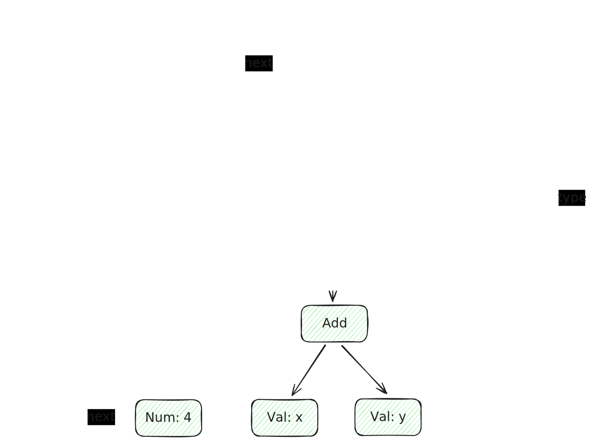

# 支持零参函数调用

函数与变量类似，是一种新的节点 ND_FNCALL, 同时在 Node 中增加 func_name 成员，用来说明标识函数名称
- ident 现在也包括了 函数
- 构造 ND_FNCALL node 时，需要为 node 添加 func_name

## 词法分析

函数与变量都是 ident，因此词法分析部分无需增加逻辑

## 类型分析

对于 ND_FNCALL，暂时将其 type 设置为 INT(假设返回值为数字)

## 语法分析

增加推导式
- ident args? 即是函数声明

```
// primary = "(" expr ")" | ident args?｜ num
// args = "(" ")"
```
primary 中更新下降式

```c
  // ident
  if (token->kind == TK_IDENT) {
    // ident args?
    if (equal(token->next, "(")) {
      Node *node = new_node(ND_FNCALL, token);
      node->func_name = strndup(token->loc, token->len);
      *rest = skip(token->next->next, ")");
      return node;
    }

    // ident var
    Object *var = find_var_by_token(token);
    if (!var) // 变量在声明中定义，必须存在
      error_token(token, "undefined variable");

    *rest = token->next;
    return new_node_var(var, token);
  }
```

## 语义分析

新的栈布局
- rv中使用 ra 作为 ret 应当加载到 pc 的地址
- 调用函数时 call 会自动地将下一指令的地址加载到 ra 中，因此在每个函数的开头，都必须保存保存ra，使得即便自己运行中调用了函数，也不必担心覆盖调用者的 ra

```
// 栈布局
//-------------------------------// sp
//              ra
//-------------------------------// ra = sp-8
//              fp
//-------------------------------// fp = sp-16
//             变量
//-------------------------------// sp = sp-16-StackSize
//           表达式计算
//-------------------------------//
```

case 处理

```
  case ND_FNCALL:
    printf("  # 调用函数%s\n", node->func_name);
    printf("  call %s\n", node->func_name);
    return;
```

ra 保存与恢复
```c
  printf("  addi sp, sp, -16\n");
  printf("  # 将ra压栈\n");
  printf("  sd ra, 8(sp)\n");
  ...
  printf("  # 恢复fp、ra和sp\n");
  printf("  ld fp, 0(sp)\n");
  printf("  ld ra, 8(sp)\n");
  printf("  addi sp, sp, 16\n");
```

# 支持最多6个参数的函数调用

rv中约定通过 `a0..a5` 6个寄存器来传递最多6个函数参数，在 call 一个多参数函数之前，需要将参数填入到 6 个寄存器中
- Node中增加 `Node *args` 成员指向AST中的多个参数
- 语法中可能将另一个函数调用放置在参数位置上，此时应当首先 call 此函数，再将其值保存到对应位置的寄存器上，再call外层的函数


## 语法分析

推导式修改

```
// primary = "(" expr ")" | ident | fncall | num
// fncall = ident "(" (assign ("," assign)*)? ")"
```

fncall 构造逻辑

```c
// fncall = ident "(" (assign ("," assign)*)? ")"
PARSER_DEFINE(fncall) {
  Token *start = token;
  token = token->next->next;

  Node head = {};
  Node *cur = &head;

  // 构造参数
  while (!equal(token, ")")) {
    if (cur != &head)
      token = skip(token, ",");

    cur->next = assign(&token, token);
    cur = cur->next;
  }

  Node *node = new_node(ND_FNCALL, start);
  node->args = head.next;
  node->func_name = strndup(start->loc, start->len);

  // 跳过 ")"
  *rest = skip(token, ")");
  return node;
}
```
primary 处理

```c
  // ident
  if (token->kind == TK_IDENT) {
    // fncall
    if (equal(token->next, "(")) {
      return fncall(rest, token);
    }
```

## 语义分析

ND_FNCALL 代码生成逻辑修改
- 参数都以 Node 形式按顺序保存在 args 成员中，因此首先顺序遍历 args, 并将每个 expr 的结果保存到栈上
- 相关指令执行完毕后，所有参数必然按属性排列在栈上，因此弹栈并按反向顺序保存到寄存器中

```c
  case ND_FNCALL: {
    int argc = 0;

    // 遍历所有参数，并将参数逐个压入栈中
    for (Node *arg = node->args; arg; arg = arg->next) {
      gen_expr(arg);
      push();
      argc++;
    }

    // 上述指令执行完毕时，参数必然按顺序放置在栈上
    // 反向弹栈
    for (int i = argc - 1; i >= 0; i--) {
      pop(func_arg_regs[i]);
    }

    printf("  # 调用函数%s\n", node->func_name);
    printf("  call %s\n", node->func_name);

    return;
  }
```

# 支持零参函数定义

支持零参函数则意味着编译器需要对多个函数进行支持
- 以函数为粒度进行 parse

修改 Function 结构体，增加 `next` 成员，将多个 Function 以链表的形式串起来，从而让代码支持多函数


## 词法分析

使用类 C 语法，因此函数定义没有采用 `fn` 类似的关键字，而是根据模式是否复合 `ident ident ()` 来决定是否按函数进行解析，因此在词法分析处不必进行修改

## 类型分析

增加 TY_FUNC 作为函数类型，与 PTR 类型相似的时，在 Type 结构体中增加 `ret_type` 成员，作为 函数类型 的返回值

```c
// 创建一个函数类型， 且返回值为ret_type
Type *func_type(Type *ret_type) {
  Type *type = calloc(1, sizeof(Type));
  type->kind = TY_FUNC;
  type->ret_type = ret_type;

  return type;
}
```

## 语法分析

推导式更新

```
// program = function*
// function = declspec declarator "{" compoundStmt*
// declspec = "int"
// declarator = "*"* ident type_suf
// type_suf = ("(" ")")?
```

其中 type_suf 用来判断是函数还是变量

```c
// type_suf = ("(" ")")?
// Type *type 为基础类型(如 int)
static Type *type_suf(Token **rest, Token *token, Type *type) {
  if (equal(token, "(")) { // 零参函数
    *rest = skip(token->next, ")");
    return func_type(type);
  }

  *rest = token;
  return type;
}
```

同时增加的 function 推导包含了先前 parse 的逻辑，而 parse 需要支持多 Function

```c
// function = declspec declarator "{" compoundStmt*
static Function *function(Token **rest, Token *token) {
  // 返回值的基础类型
  Type *type = declspec(&token, token);

  // type为函数类型
  // 指向 return type, 同时判断指针
  // type->token 指向了 ident 对应的 token
  type = declarator(&token, token, type);

  // 清空局部变量
  LOCALS = NULL;

  Function *func = calloc(1, sizeof(Function));
  func->name = get_ident(type->token);

  token = skip(token, "{");
  func->body = compound_stmt(rest, token);
  func->locals = LOCALS;
  return func;
}
```

## 语义分析

由于存在多个函数，因此在 call 与 return 的地方都要利用函数名进行区分, 因此在段标签生成上需要为每个函数单独进行处理
- assign_local_val_offsets 需要为每个函数处理
- 使用一个全局的 CUR_FUNC 记录现在正在处理的函数

# 支持最多6个参数的函数定义

扩展 Function 结构体，增加 `params` 字段表示形参
- 形参 也是 Locals, 此处单独处理是因为函数调用时，params要进行单独赋值

扩展 Type 结构体，增加 `params` 与 `next`
- 形参由多个 Type 组合而成(此时仅支持多个 TYPE_INT)
- `next` 字段允许Type构成链表
- `params` 作为 TY_FUNC 类型的扩充字段，指向形参链表头



## 类型分析

增加 `copy_type` 函数, 对栈上的 Type 进行浅拷贝

```
// 复制类型
// 浅拷贝，仅复制栈上数据
Type *copy_type(Type *type) {
  Type *rlt = calloc(1, sizeof(Type));
  *rlt = *type;

  return rlt;
}
```

允许对函数进行参数声明之后，需要在 `add_type` 逻辑中补充对于参数的类型构造

```
  // 访问所有参数以增加类型
  for (Node *n = node->args; n; n = n->next)
    add_type(n);
```

## 语法分析

推导式修改

```
// type_suf = ("(" func_params? ")")?
// func_params = param ("," param)*
// param = declspec declarator
```

`type_suf` 逻辑变化
- 为函数时，支持形参的解析，通过构造 Type 链表，构造形参链表，并存储到 TY_FUNC 类型的 Type 的 `params` 字段中

```c
// type_suf = ("(" func_params? ")")?
// func_params = param ("," param)*
// param = declspec declarator
// Type *type 为基础类型(如 int)
static Type *type_suf(Token **rest, Token *token, Type *type) {
  if (equal(token, "(")) { // 函数
    token = token->next;

    // 存储形参
    Type head = {};
    Type *cur = &head;

    while (!equal(token, ")")) {
      if (cur != &head)
        token = skip(token, ",");

      Type *base_type = declspec(&token, token);
      // 不可将 declspec 嵌套的原因是
      // declarator 的前几个参数会先准备好，然后再调用 declspec
      // 而因此导致的 token 变化无法被 declarator 感知
      // 因此不能将 declspec 进行嵌套
      Type *dec_type = declarator(&token, token, base_type);

      // dec_type 为局部变量，地址不会改变，因此每次都需要拷贝，否则链表就会成环
      cur->next = copy_type(dec_type);
      cur = cur->next;
    }

    // 将参数加入到函数 Type 中
    type = func_type(type);
    type->params = head.next;

    *rest = token->next;
    return type;
  }

  *rest = token;
  return type;
}
```

function 逻辑中，在构造 comp stmt 之前(生成函数中 LOCALS之前), 将形参加入其中，并从 Type 生成 Object, 保存到 `func->params` 字段
- 头插保证了每次 LOCALS 更新后，LOCALS 链表头都会变, 因此在 `构造 comp stmt` 前后， LOCALS值是不同的

```c
// 递归地将函数形参加入到 Local 中
static void insert_param_to_locals(Type *param) {
  if (param) {
    insert_param_to_locals(param->next);
    new_local_var(get_ident(param->token), param);
  }
}


  insert_param_to_locals(type->params);
  func->params = LOCALS;
```

## 语义分析

增加对形参的赋值, 即从约定好的寄存器中，将值拷贝到形参对应的内存地址上

```c
    int i = 0;
    for (Object *var = f->params; var; var = var->next) {
      printf("  # 将%s寄存器的值存入%s的栈地址\n", func_arg_regs[i], var->name);
      printf("  sd %s, %d(fp)\n", func_arg_regs[i++], var->offset);
    }
```

